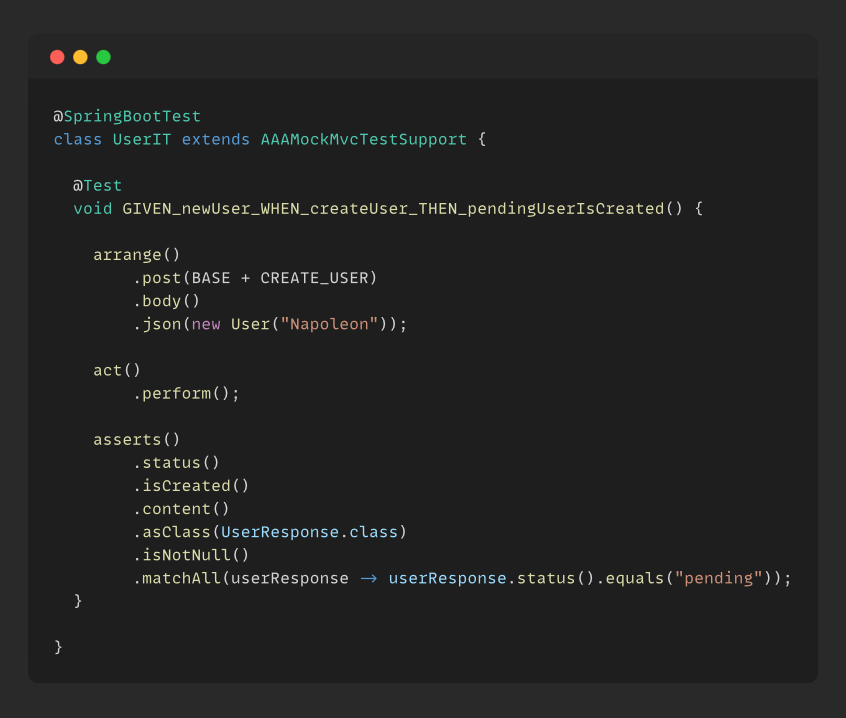

[](https://sonarcloud.io/summary/new_code?id=co-mmer_aaa-mockmvc)
[](https://sonarcloud.io/summary/new_code?id=co-mmer_aaa-mockmvc)
[](https://sonarcloud.io/summary/new_code?id=co-mmer_aaa-mockmvc)
[](https://sonarcloud.io/summary/new_code?id=co-mmer_aaa-mockmvc)
[](https://sonarcloud.io/summary/new_code?id=co-mmer_aaa-mockmvc)
[](https://sonarcloud.io/summary/new_code?id=co-mmer_aaa-mockmvc)


## Overview

**AAA-MockMvc** is a fluent testing framework for Spring's MockMvc that enforces the
Arrange-Act-Assert (AAA)
pattern and reduces boilerplate in controller tests.
The library guides developers through each testing phase with a strongly-typed,
step-by-step API, ensuring a consistent and intuitive test structure. Common tasks such as
request setup, ObjectMapper-based serialization, and response assertions are fully abstracted,
allowing developers to focus on the test logic itself rather than technical overhead.

### Example


<details>
<summary>Code</summary>

```java
public record User(String name) {

}

public record UserResponse(String status) {

}

@RestController
@RequestMapping(BASE)
public class UserController {

  @PostMapping(CREATE_USER)
  public ResponseEntity<UserResponse> createUser(@RequestBody User user) {
    var response = new UserResponse("pending");
    return new ResponseEntity<>(response, HttpStatus.CREATED);
  }
}

@SpringBootTest
class UserIT extends AAAMockMvcTestSupport {

  @Test
  void GIVEN_newUser_WHEN_createUser_THEN_pendingUserIsCreated() {
    arrange()
        .post(BASE + CREATE_USER)
        .body()
        .json(new User("Napoleon"));

    act()
        .perform();

    asserts()
        .status()
        .isCreated()
        .content()
        .asClass(UserResponse.class)
        .isNotNull()
        .matchAll(userResponse -> userResponse.status().equals("pending"));
  }

}

```

</details>

---

> ⚠️ You are reading the documentation for AAA-MockMvc 2.0.0-RC1 (currently Release Candidate).  
> For the stable 1.x series, see [README-1.x.md](./README-1.x.md).

---

## Table of Contents

- [Overview](#overview)
- [News](#news)
- [User Guide](#user-guide)
- [License](#License)

---

## News

### 🌿 Release v2.0.0-RC1

This is a quality-of-life release poured with a lot of care tests read cleaner and fail clearer.

#### What’s new

- AAA blocks are now much simpler — shorter and easier to follow.
- The phases are clearly separated, making each test easier to scan.
- New steps let you group multiple AAA blocks in one test and put a clear name on error messages.
- Sharper snapshot behavior: act().perform() runs once; assertions and answers stay pure (no extra
  I/O).
- See full details in the [Changelog](./CHANGELOG.md#200)

---

## User Guide

- [1. Installation](#1-installation)
- [2. Getting Starting](#2-getting-started)
- [3. Creating a Test](#3-creating-a-test)
    - [3.1. Phase Arrange](#31-phase-arrange)
    - [3.2. Phase Act](#32-phase-act)
    - [3.3. Phase Assert](#33-phase-assert)
    - [3.4. Phase Answer](#34-phase-answer)
- [4. Working with Steps ](#4-working-with-steps)
    - [4.1. Using steps](#41-using-step)
    - [4.2. Using steps with return-object](#42-using-step-with-answer)
- [5. Using Custom Bean ](#5-using-custom-beans)
    - [ObjectMapper](#51-objectmapper)
    - [MockMvc](#52-mockmvc)
- [6. Manuel Setup](#6-manuel-setup)
    - [Getting Starting](#61-getting-starting)
    - [Creating a Test](#62-creating-a-test)
    - [Working with Steps](#63-using-steps)

---

## 1. Installation

To include AAA-MockMvc in the project, add the following dependency to the `pom.xml`.
The sources can also be downloaded directly to access the documentation of the classes.

```xml

<dependency>
  <groupId>io.github.co-mmer</groupId>
  <artifactId>aaa-mockmvc</artifactId>
  <version>2.0.0-RC1</version>
  <scope>test</scope>
</dependency>

```

---

## 2. Getting Started

AAA-MockMvc uses a **typed fluent API** that guides you through the classic AAA flow:

- **Arrange** – build the request (method, URL/URI, query, headers, body).
- **Act** – execute the request **once** and capture a **snapshot** (status, headers, body).
- **Assert** – verify the snapshot; no additional I/O is performed.
- **Answer** (optional) – read the same snapshot as data (string/bytes/object/list/set/map).

The Framework exposes only **context-appropriate methods**. For example, `GET/DELETE/HEAD/OPTIONS`
do **not** offer a request body, while `POST/PUT/PATCH` do.

> For more details and edge cases (e.g., headers, content negotiation, error messages),
> see the JavaDoc of the arrange/act/assert/answer APIs.

---

## 3. Creating a Test

To use AAA-MockMvc, the test class must first inherit from '**AAAMockMvcTestSupport**'

`AAAMockMvcTestSupport` exposes the AAA entry
points (`arrange()`, `act()`, `asserts()`, `answer()` , `step()`)

``` java

@SpringBootTest
class MyTest extends AAAMockMvcTestSupport {

}
```

### 3.1 Phase arrange

Build the request: choose the HTTP method and URL/URI, then (optionally) add path variables,
query parameters, headers, and a body. **No network I/O happens in this phase**—execution occurs
later in `act().perform()`.

> For details and edge cases, see the JavaDoc of the arrange APIs.

**Examples**

```java

@SpringBootTest
class MyTest extends AAAMockMvcTestSupport {

  @Test
  void GIVEN_newUser_WHEN_createUser_THEN_pendingUserIsCreated() {

    arrange()
        .post(BASE + CREATE_USER)
        .query("lang", "de")
        .body()
        .json(new User("Napoleon"))
        .headers()
        .auth("token-123");
  }
}
```

### 3.2 Phase act

Execute the arranged request **once** and capture a **response snapshot** (status, headers, body).
No assertions are performed here; verification happens in the next phase.

> For details and edge cases, see the JavaDoc of the act APIs.

**Examples**

``` java
@SpringBootTest
class MyTest extends AAAMockMvcTestSupport {

  @Test
  void GIVEN_newUser_WHEN_createUser_THEN_pendingUserIsCreated() {
    
    arrange()
        .post(BASE + CREATE_USER)
        .query("lang", "de")
        .body()
        .json(new User("Napoleon"))
        .headers()
        .auth("token-123");
    
    act()
      .perform();
    
  }
}
```

### 3.3 Phase assert

Verify the response **snapshot** captured in `act().perform()`. No additional I/O happens here.

**What you can assert**

- **Status**: exact codes or ranges.
- **Headers**: key presence , key–value pairs and exact multi-value matches.
- **Content** as **string / bytes / object / collection / map**   *(object/collection/map use the
  configured ObjectMapper)*

> For details and edge cases, see the JavaDoc of the asserts APIs.

**Examples**

```java

@SpringBootTest
class MyTest extends AAAMockMvcTestSupport {

  @Test
  void GIVEN_newUser_WHEN_createUser_THEN_pendingUserIsCreated() {

    arrange()
        .post(BASE + CREATE_USER)
        .query("lang", "de")
        .body()
        .json(new User("Napoleon"))
        .headers()
        .auth("token-123");

    act()
        .perfrom();

    asserts()
        .status()
        .isCreated()
        .content()
        .asClass(UserResponse.class)
        .isNotNull()
        .matchAll(userResponse -> userResponse.status().equals("pending"));
  }
}

```

### 3.4 Phase answer

Read data from the **same snapshot** captured in `act().perform()`—**no additional I/O** is
performed. Use this to drive follow-up steps (e.g., IDs, payloads, or full objects).

- Return as **string** / **bytes**
- Deserialize as **object**, **list**, **set**, or **map** (uses the configured ObjectMapper)

> For details and edge cases, see the JavaDoc of the answer APIs.

**Examples**

```java

@SpringBootTest
class MyTest extends AAAMockMvcTestSupport {

  @Test
  void GIVEN_newUser_WHEN_createUser_THEN_pendingUserIsCreated() {

    arrange()
        .post(BASE + CREATE_USER)
        .query("lang", "de")
        .body()
        .json(new User("Napoleon"))
        .headers()
        .auth("token-123");

    act()
        .perfrom();

    asserts()
        .status()
        .isCreated()
        .content()
        .asClass(UserResponse.class)
        .isNotNull()
        .matchAll(userResponse -> userResponse.status().equals("pending"));

    var userResponse = answer().asObject(UserResponse.class);
  }
}

```

---

## 4. Working with Steps

Use **steps** to group multiple AAA blocks within a single test. A step gives your flow a **name**,
isolates **state**, and makes **failure messages** easier to read (“Step 'Create user' …”).

**When to use**

- You call **multiple endpoints** in one test (e.g., create → update → verify).
- You need to **pass data** from one response to the next request.

### 4.1 Using Step

Wrap a named, isolated AAA block in a **step** to improve readability and error messages.
This example shows multiple steps **without** using `answer()`.

**Examples**

```java

@SpringBootTest
class UserIT extends AAAMockMvcTestSupport {

  @Test
  void GIVEN_addTwiceUser_WHEN_loadUsers_THEN_containExpectedUsers() {

    step(
        "Add Napoleon", () -> {
          arrange()
              .post(BASE + CREATE_USER)
              .body().json(new User("Napoleon"));
          act().perform();
          asserts().status().isCreated();
        });

    step(
        "Add Gandolf", () -> {
          arrange()
              .post(BASE + CREATE_USER)
              .body().json(new User("Gandolf"));
          act().perform();
          asserts().status().isCreated();
        });

    step(
        "Napoleon and Gandolf are saved", () -> {
          arrange().get(BASE + USERS);
          act().perform();
          asserts()
              .content().asList(User.class)
              .hasSize(2)
              .matchAny(
                  user -> user.name().equals("Napoleon"),
                  user -> user.name().equals("Gandolf")
              );
        });
  }
}

```

### 4.2 Using Step with Answer

A step can return a value. Inside the step, the value comes from the last call to answer()
.as…(...). If you don’t call answer() at all, the step returns null.
The result type is simply inferred from where you assign it.

**Examples**

```java

@SpringBootTest
class UserIT extends AAAMockMvcTestSupport {

  @Test
  void GIVEN_two_users_WHEN_list_THEN_contains_both() {
    step(
        "Add Napoleon", () -> {
          arrange()
              .post(BASE + CREATE_USER)
              .body().json(new User("Napoleon"));
          act().perform();
          asserts().status().isCreated();
        });

    step(
        "Add Gandolf", () -> {
          arrange()
              .post(BASE + CREATE_USER)
              .body().json(new User("Gandolf"));
          act().perform();
          asserts().status().isCreated();
        });

    List<User> users = step(
        "Napoleon and Gandolf are saved", () -> {
          arrange().get(BASE + USERS);
          act().perform();
          asserts()
              .content().asList(User.class)
              .hasSize(2)
              .matchAny(
                  user -> user.name().equals("Napoleon"),
                  user -> user.name().equals("Gandolf"));
          answer().asList(User.class);
        });
  }
}

```

---

## 5. Using Custom Beans

AAA-MockMvc automatically **discovers and uses** your existing Spring beans.

**Discovery order**

1. If a **MockMvc** bean exists, it is used as-is; otherwise a default instance is built.
2. If an **ObjectMapper** bean exists, it is used; otherwise a default mapper is created.

### 5.1 ObjectMapper

Provide a Spring bean and AAA-MockMvc will use it automatically.

```java

@SpringBootTest
class BeanObjectMapperCustomIT extends AAAMockMvcTestSupport {

  @TestConfiguration
  static class ObjectMapperConfig {

    @Bean
    public ObjectMapper objectMapper() {
      var mapper = new ObjectMapper();
      var module = new SimpleModule();
      module.addDeserializer(String.class, new UpperCaseStringDeserializer());
      mapper.registerModule(module);
      return mapper;
    }
  }

  @Test
  void GIVEN_customObjectMapper_THEN_Uppercase() {
    arrange()
        .get(BASE + GET_USER);

    act()
        .perform();

    asserts()
        .content()
        .asClass(UserResponse.class)
        .matchAll(userResponse -> userResponse.status().equals("PENDING"));
  }
}
```

### 5.2 MockMvc

Expose a preconfigured MockMvc bean — filters, interceptors, and default actions are respected.

```java

@SpringBootTest
class BeanMockMvcCustomIT extends AAAMockMvcTestSupport {

  @TestConfiguration
  static class MockMvcConfig {

    @Bean
    public MockMvc mockMvc(WebApplicationContext wac) {
      var filter = new OncePerRequestFilter() {
        @Override
        @SneakyThrows
        protected void doFilterInternal(HttpServletRequest req, HttpServletResponse res,
            FilterChain chain) {
          res.addHeader("X-Custom-MockMvc", "active");
          chain.doFilter(req, res);
        }
      };

      return MockMvcBuilders.webAppContextSetup(wac)
          .addFilters(filter)
          .alwaysDo(print())
          .build();
    }
  }

  @Test
  void GIVEN_customMockMvc_THEN_customHeader() {
    arrange()
        .get(BASE + GET_USER);

    act()
        .perform();

    asserts()
        .headers()
        .containsEntry("X-Custom-MockMvc", "active");
  }
}
```

---

## 6. Manuel Setup

While the recommended entry point is `AAAMockMvcTestSupport` (it auto-wires everything and keeps
tests
lean), you can also use the framework without extending it.
Simply import the Spring configuration and inject `AAAMockMvc` yourself.

### 6.1 Getting Starting

To use AAA-MockMvc without `AAAMockMvcTestSupport`, add `@ExtendWith(AAAMockMvcExtension.class)`
and `@Import(AAAMockMvcConfig.class)` to your test and autowire an `AAAMockMvc` field.

``` java

@ExtendWith(AAAMockMvcExtension.class)
@Import(AAAMockMvcConfig.class)
@SpringBootTest
class MyTest {

  @Autowired
  private AAAMockMvc aaa;

}
```

### 6.2 Creating a Test

For a deeper dive into AAA, see Chapter 3 – [Creating a Test](#3-creating-a-test)

``` java

@ExtendWith(AAAMockMvcExtension.class)
@Import({AAAMockMvcConfig.class})
@SpringBootTest
class UserIT {

  @Autowired
  private AAAMockMvc aaa;

  @Test
  void GIVEN_user_WHEN_create_THEN_status_is_created() {
    aaa.arrange()
        .post(BASE + CREATE_USER)
        .body()
        .json(new User("Napoleon"));

    aaa.act()
        .perform();

    aaa.asserts()
        .status()
        .isCreated();
  }
}

```

### 6.3 Using steps

For a deeper dive into steps, see Chapter 4 – [Working with Steps](#4-working-with-steps)

``` java

@ExtendWith(AAAMockMvcExtension.class)
@Import({AAAMockMvcConfig.class})
@SpringBootTest
class UserIT {

  @Autowired
  private AAAMockMvc aaa;

  @Test
  void GIVEN_two_users_WHEN_list_THEN_contains_both() {
    aaa.step("Add Napoleon", () -> {
      aaa.arrange()
          .post(BASE + CREATE_USER)
          .body().json(new User("Napoleon"));
      aaa.act().perform();
      aaa.asserts().status().isCreated();
    });

    aaa.step("Add Gandalf", () -> {
      aaa.arrange()
          .post(BASE + CREATE_USER)
          .body().json(new User("Gandalf"));
      aaa.act().perform();
      aaa.asserts().status().isCreated();
    });

    List<User> users = aaa.step("Napoleon and Gandolf are saved", () -> {
      aaa.arrange().get(BASE + USERS);
      aaa.act().perform();
      aaa.asserts()
          .content().asList(User.class)
          .hasSize(2)
          .matchAny(
              u -> u.name().equals("Napoleon"),
              u -> u.name().equals("Gandalf"));
      aaa.answer().asList(User.class); 
    });
  }
}


```

---

## License

This project is licensed under the Apache License, Version 2.0. See `LICENSE.txt` for more
information.

