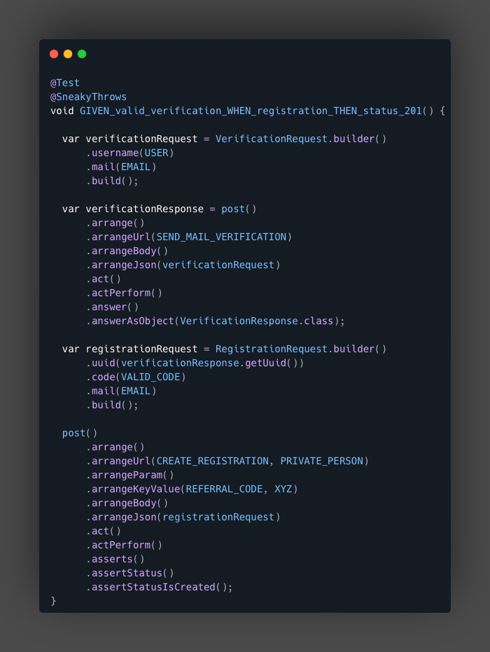

<table>
  <tr>
    <td></td>
    <td><h1>AAA-MockMvc</h1></td>
  </tr>
</table>

[](https://sonarcloud.io/summary/new_code?id=co-mmer_aaa-mockmvc)
[](https://sonarcloud.io/summary/new_code?id=co-mmer_aaa-mockmvc)
[](https://sonarcloud.io/summary/new_code?id=co-mmer_aaa-mockmvc)
[](https://sonarcloud.io/summary/new_code?id=co-mmer_aaa-mockmvc)
[](https://sonarcloud.io/summary/new_code?id=co-mmer_aaa-mockmvc)
[](https://sonarcloud.io/summary/new_code?id=co-mmer_aaa-mockmvc)


## Overview

A fluent testing framework for Spring's MockMvc that enforces the Arrange-Act-Assert (AAA)
pattern and reduces boilerplate in controller tests.
The library guides developers through each testing phase with a strongly-typed,
step-by-step API, ensuring a consistent and intuitive test structure. Common tasks such as
request setup, ObjectMapper-based serialization, and response assertions are fully abstracted,
allowing developers to focus on the test logic itself rather than technical overhead.



___

## Table of Contents

- [Installation](#Installation)
- [Starting](#starting)
- [Writing Tests](#writing-tests)
- [Example](#example)
- [License](#License)

---

## Installation

To include AAAMockMvc in the project, add the following dependency to the `pom.xml`.
The sources can also be downloaded directly within the IDE (e.g. IntelliJ IDEA) to access the
documentation of the classes.

```xml

<dependency>
  <groupId>io.github.co-mmer</groupId>
  <artifactId>aaa-mockmvc</artifactId>
  <version>1.5.0</version>
  <scope>test</scope>
</dependency>

```

---

## Starting

### AAAMockMvcAbstract

The base class `AAAMockMvcAbstract` is the preferred entry point for using the AAAMockMvc framework.

- It provides direct access to all supported HTTP methods via convenient test request objects (
  e.g., `get()`, `post()`, `put()`, etc.)
- It automatically configures and injects an internal `AAAMockMvc` instance via Spring's dependency
  injection mechanism
- It performs `automatic configuration` by detecting and reusing existing beans (e.g., custom
  MockMvc
  or ObjectMapper) from the Spring context

### Example

```java

@SpringBootTest
class ExampleIT extends AAAMockMvcAbstract {

  @Test
  @SneakyThrows
  void GIVEN_defaultObjectMapper_THEN_countryCodeIsInLowercase() {
    get()
        .arrange()
        .arrangeUrl(GET_EXAMPLE)
        .act()
        .actPerform()
        .asserts()
        .assertContentAsClass()
        .assertClassMatchAll(SimpleObject.class, obj -> obj.countryCode().equals("de"));
  }
}
```

```java

@RestController
@RequestMapping(BASE)
public class SimpleController {

  @GetMapping(EXAMPLE)
  public ResponseEntity<SimpleObject> getSimpleObject() {
    var simpleObject = new SimpleObject("de");
    return new ResponseEntity<>(simpleObject, HttpStatus.OK);
  }
}
```

### Using Custom ObjectMapper or MockMvc Beans

If the project already defines a custom ObjectMapper or MockMvc bean (e.g. for custom
serialization), these will automatically be detected and used by AAAMockMvcAbstract.
This is made possible by the Spring ObjectProvider mechanism used in AAAMockMvcConfig. No additional
configuration is necessary — the framework automatically picks up the existing beans and integrates
them internally.

### Example

```java

@SpringBootTest
class ExampleIT extends AAAMockMvcAbstract {

  @TestConfiguration
  static class ObjectMapperConfig {

    @Bean
    public ObjectMapper objectMapper() {
      var mapper = new ObjectMapper();
      var module = new SimpleModule();
      module.addDeserializer(String.class, new UpperCaseStringDeserializer());
      mapper.registerModule(module);
      return mapper;
    }
  }

  @Test
  @SneakyThrows
  void GIVEN_customObjectMapper_THEN_countryCodeIsInUpperCase() {
    get()
        .arrange()
        .arrangeUrl(GET_EXAMPLE)
        .act()
        .actPerform()
        .asserts()
        .assertContentAsClass()
        .assertClassMatchAll(SimpleObject.class, obj -> obj.countryCode().equals("DE"));
  }
}
```

___

## Writing Tests

In the provided library, every test follows the AAA structure using the following three phases:

1. **Arrange**: Set up the necessary conditions for the test (e.g., define URL, parameters,
   headers).
2. **Act**: Perform the operation (e.g., make the API request).
3. **Assert**: Validate the result (e.g., check HTTP status, response content).
4. **Answer**: Optionally, the result of the request can be accessed using the `answer()` method,
   allowing for further examination and validation of the response. Additionally, the returned
   object can be passed back as the body of a subsequent request using `arrangeJson(T content)`.
   This enables used to set up the next, creating a seamless flow in
   testing. [For more details, see the example below.](#example)

### Arrange

- [Arrange Url](docs/arrange/ArrangeUrl.md)
- [Arrange Head](docs/arrange/ArrangeHead.md)
- [Arrange Body Raw](docs/arrange/ArrangeBodyRaw.md)
- [Arrange Body Binary](docs/arrange/ArrangeBodyBinray.md)

### Assert

- [Assert Status](docs/assert/AssertStatus.md)
- [Assert ContentAsString](docs/assert/AssertString.md)
- [Assert ContentAsClass 🔸 (New)](docs/assert/AssertClass.md)
- [Assert ContentAsByte](docs/assert/AssertByte.md)
- [Assert ContentAsCollection 🔸 (New)](docs/assert/AssertCollection.md)
- [Assert ContentAsMap 🔸 (New)](docs/assert/AssertMap.md)
- [Assert Head](docs/assert/AssertHead.md)
- [Assert Custom](docs/assert/AssertCustom.md)

### Answer

- [Answer](docs/answer/Answer.md)

---

## Example

This example demonstrates a registration process, where the user's email address must first
be verified by sending a code. After the email verification, the user can proceed with the
registration, including providing the verification code. The process is split into two main steps:

1. **Email Verification**: A verification code is sent to the provided email address.
2. **Registration**: After receiving the verification code, the user sends it back to the backend
   for validation, allowing them to complete their registration.

### Main Code

<details>
<summary>Implementation of Registration Scenario</summary>

### 1. Verification Response Model

The `VerificationResponse` class represents the response that contains the verification code, UUID,
and email after the verification process:

```java
public class VerificationResponse {

  private String code;
  private String uuid;
  private String mail;
}
```

### 2. Verification Controller

The `VerificationController` is responsible for handling the verification request. It receives a
request with the user's email and generates a verification response containing a unique UUID and a
dummy verification code sent to the provided email.

```java

@RestController
@RequestMapping(Api.BASE)
public class VerificationController {

  @PostMapping(Api.CREATE_VERIFICATION)
  public ResponseEntity<VerificationResponse> createVerification(
      @RequestBody VerificationRequest verification) {

    var response = VerificationResponse
        .builder()
        .mail(verification.getMail())
        .uuid(UUID.randomUUID().toString())
        .build();

    // Simulate sending a verification code to the user's email
    return new ResponseEntity<>(response, HttpStatus.OK);
  }
}

```

### 3. Registration Models

The `RegistrationAddress` class holds the user's address details, while the `RegistrationRequest`
contains both the address and the verification response (which includes the verification code, UUID,
and email):

```java
public class RegistrationAddress {

  private String street;
  private String houseNumber;
  private String zip;
  private String city;
  private String country;
}

public class VerificationResponse {

  private String code;
  private String uuid;
  private String mail;
}

public class RegistrationRequest {

  private RegistrationAddress address;
  private VerificationResponse verification;
}
```

### 4. Registration Controller

The `RegistrationController` handles the registration process. Once the user sends the verification
code, the backend will validate it and, if valid, complete the registration process.

```java

@RestController
@RequestMapping(Api.BASE)
public class RegistrationController {

  @PostMapping(Api.CREATE_REGISTRATION)
  public ResponseEntity<Void> createRegistration(@RequestBody RegistrationRequest registration) {
    // Simulate the process of verifying the code entered by the user
    return new ResponseEntity<>(HttpStatus.CREATED);
  }
}

```

</details>

### Test Code

The following examples demonstrate the same test scenario written in two different ways. First, the
test is implemented using MockMvc, the traditional approach for performing HTTP tests in Spring.
This is followed by the same test written with AAAMockMvc.

To keep the tests straightforward and focused on the core testing logic, the use of private helper
methods has been intentionally avoided. This ensures clarity and helps highlight the differences
between the two testing approaches.

### Test with MockMvc

```java

@Autowired
private MockMvc mockMvc;

@Autowired
private ObjectMapper objectMapper;

@Test
@SneakyThrows
void GIVEN_valid_code_WHEN_registration_THEN_status_201() {

  var verificationRequest = VerificationRequest.builder()
      .firstname(FIRSTNAME)
      .lastname(LASTNAME)
      .mail(EMAIL)
      .build();

  var content = MockMvcRequestBuilders.post(SEND_MAIL_VERIFICATION)
      .contentType(MediaType.APPLICATION_JSON)
      .content(objectMapper.writeValueAsString(verificationRequest));

  var verificationResponseJson = mockMvc.perform(content)
      .andReturn()
      .getResponse()
      .getContentAsString();

  var verificationResponse = objectMapper.readValue(
      verificationResponseJson, VerificationResponse.class);

  var registrationRequest = RegistrationRequest.builder()
      .verification(VerificationResponse.builder()
          .code(VALID_CODE)
          .mail(verificationResponse.getMail())
          .uuid(verificationResponse.getUuid())
          .build())
      .build();

  content = MockMvcRequestBuilders.post(POST_CREATE_REGISTRATION)
      .contentType(MediaType.APPLICATION_JSON)
      .content(objectMapper.writeValueAsString(registrationRequest));

  mockMvc.perform(content).andExpect(status().isCreated());
}

```

### Test with AAAMockMvc

```java

@Test
@SneakyThrows
void GIVEN_valid_code_WHEN_registration_THEN_status_201() {

  var verificationRequest = VerificationRequest.builder()
      .firstname(FIRSTNAME)
      .lastname(LASTNAME)
      .mail(EMAIL)
      .build();

  var verificationResponse = post()
      .arrange()
      .arrangeUrl(SEND_VERIFICATION)
      .arrangeBody()
      .arrangeJson(verificationRequest)
      .act()
      .actPerform()
      .answer()
      .answerAsObject(VerificationResponse.class);

  var registrationRequest = RegistrationRequest
      .builder()
      .verification(VerificationResponse.builder()
          .code(VALID_CODE)
          .mail(verificationResponse.getMail())
          .uuid(verificationResponse.getUuid())
          .build())
      .build();

  post()
      .arrange()
      .arrangeUrl(CREATE_REGISTRATION)
      .arrangeBody()
      .arrangeJson(registrationRequest)
      .act()
      .actPerform()
      .asserts()
      .assertStatus()
      .assertStatusIsCreated();
}

```

---

## License

This project is licensed under the Apache License, Version 2.0. See `LICENSE.txt` for more
information.

